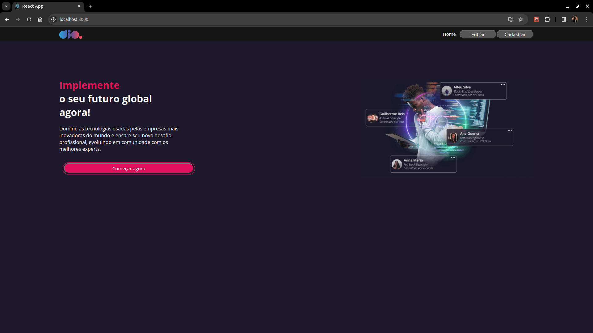
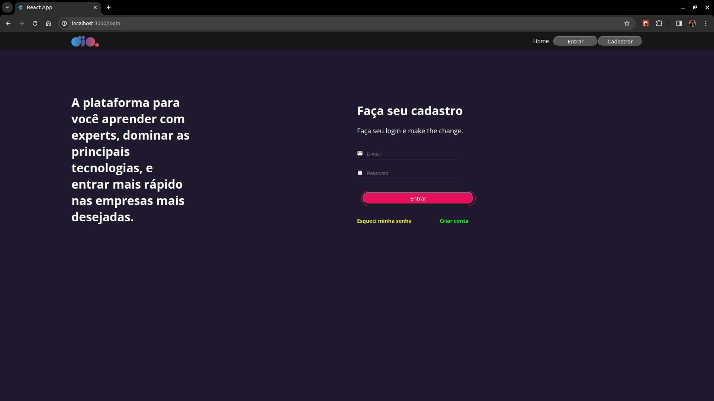
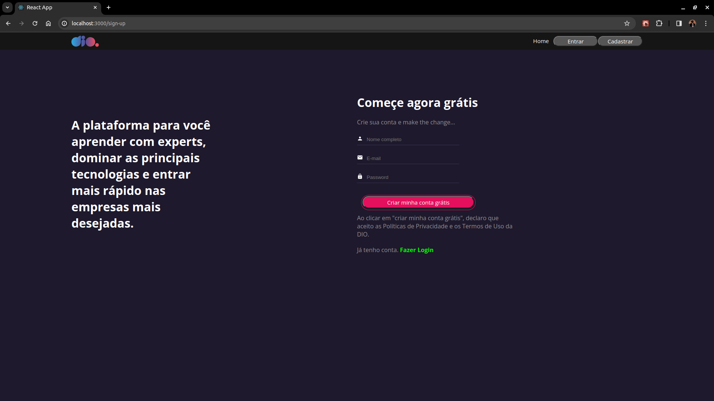
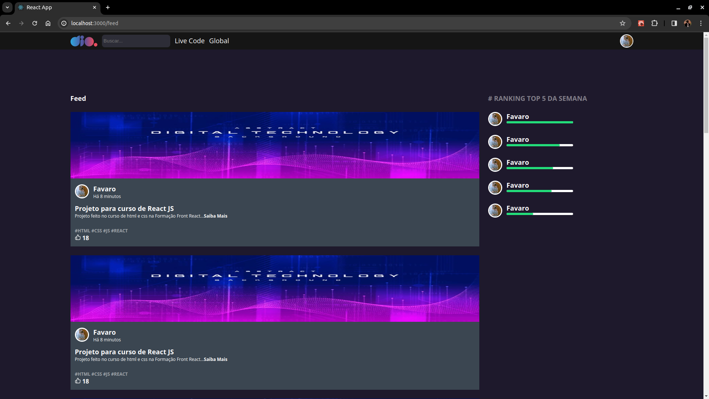

# Projeto: Clone tela de cadastro DIO

Este projeto foi desenvolvido como parte do desafio **Desenvolvendo a Tela de Cadastro da Plataforma Dio com React**.






## Descrição
O projeto foi baseado no seguinte [Figma](https://www.figma.com/file/fvjQQNtqaUdpuNixvCZVav/DIO-CLONE?type=design&node-id=0-1&mode=design&t=iFU0b4fOGPVWlfuo-0)

## Funcionalidades
- Cadastro
- Login

## Como usar

1. Clone o repositório para o seu ambiente local:

   ```bash
   git clone https://github.com/FavaroDarkStar/clone-tela-de-cadastro-dio.git
   ``` 
 
2. Acesse o diretório do projeto:

   ```bash
   cd clone-tela-de-cadastro-dio
   ```

3. Instale as dependências necessárias:

   ```bash
   npm install
   ```

4. Execute o aplicativo:

   ```bash
   npm start
   ```

5. Execute o servidor:

   ```bash
   npm run api
   ```

5. Abra o navegador e acesse [http://localhost:3000](http://localhost:3000) para visualizar o aplicativo em ação.

